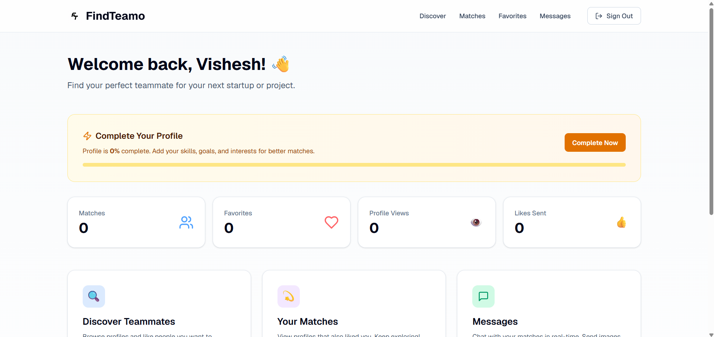
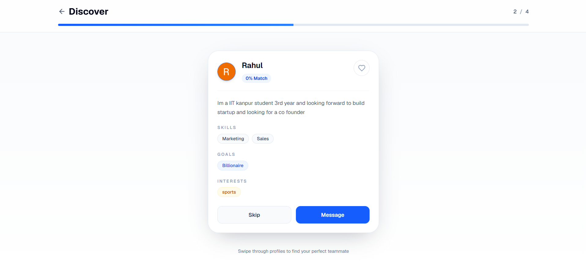
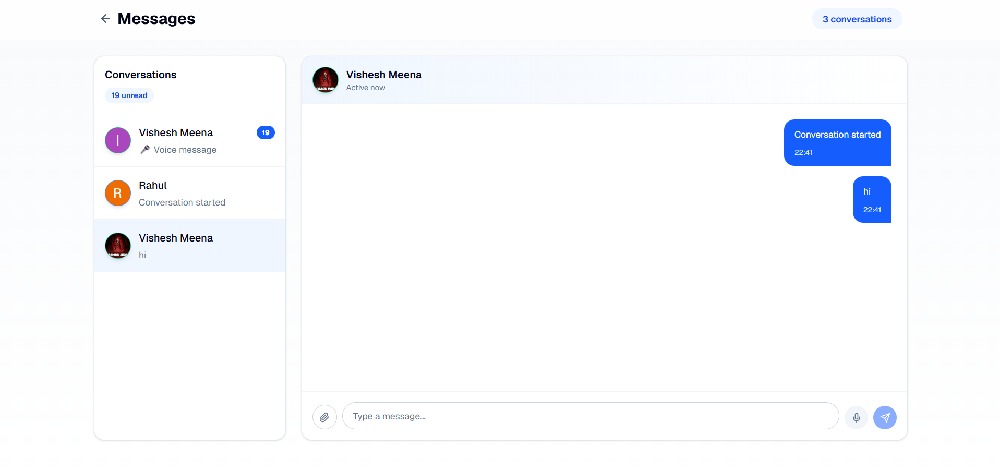

# FindTeamo

Swipe based app for finding hackathon teammates and cofounders. Built it because I was sick of the last-minute "anyone free to join my team.??" panic in Discord before every hackathon.

## Why

I have done 16+ hackathons. Every single one has a minimum team size rule, and every single time there's a mad scramble in the last hour or two before deadline trying to find teammates. I've seen genuinely talented solo devs get stuck with nobody, or thrown into a random team that doesn't even overlap on skills, just because there was no real way to filter for that.

Same story with finding a cofounder honestly. You just get pinged by randoms and have zero idea if their goals or commitment level actually match yours until weeks in, and at last they just waste your time.

So instead of dealing with that again I just built the thing I wish existed. Swipe on profiles, match on actual shared skills/goals, chat once you match. That's it.

I'm 15 and been building solo for like a year and a bit now (Verba, CareAlong, Lyrova, Smriti before this one) but this is the first thing I've taken all the way to something real — actual auth, a real database, live chat, deployed and working.

## What it does

- Make a profile - skills, what you're looking for (hackathon squad / cofounder / startup), how many hours a week you can put in
- Discover page shows other profiles as swipeable cards, sorted by a match score I calculate off shared skills/goals/interests/experience/hours
- Like or skip. Both liked each other = match
- Once matched you can message inside the app — text, images, voice notes, all live

## Tech stack

- Next.js (App Router), React, Tailwind
- Supabase — Postgres, Auth (Google OAuth), Realtime, Storage
- Hosted on Vercel

## Screenshots





## Demo

Live: [findteamo.vercel.app](https://findteamo.vercel.app)

## Running it locally

```bash
git clone https://github.com/vishhbusiness236-lang/FindTeamo.git
cd FindTeamo
npm install
```
Add a `.env.local`:
```
NEXT_PUBLIC_SUPABASE_URL=your_url
NEXT_PUBLIC_SUPABASE_ANON_KEY=your_key
```


```bash
npm run dev
```

## Bugs I actually got stuck on

The messaging RLS took me almost a full day. Kept getting "new row violates row-level security policy" on three different tables one after another - conversations, then messages, then the storage bucket for chat media. Every time I'd fix one, the next insert would fail on a different table. Ended up just relaxing the insert policies to `authenticated` + `true` for now, want to tighten those up properly later.

Also had messages showing up twice in the chat for a while. Turned out I was adding the message to local state right after sending it and the realtime subscription was adding it again when the insert event fired. Took embarrassingly long to notice both were doing the same job. Fixed by dropping the local update completely and letting the realtime subscription be the only thing that touches the messages list.

There was also a random 404 on the conversations API route that turned out to just be a stale Turbopack cache, not an actual code problem. Cleared `.next` and it was fine. Wasted like 40 minutes on that before realizing.

## Routes

- `/` — landing
- `/login` — Google OAuth
- `/dashboard` — home, profile completion tracker
- `/profile` — edit skills/goals/availability
- `/discover` — swipe and match
- `/matches` — your mutual matches
- `/messages` — chat with matches

## What's next

- Filter discovery by specific tech stack instead of just general skill tags
- Some kind of rating/reputation thing after a hackathon ends, so people know who's actually reliable
- Maybe I`ll try to scale it and launch it. I believe that it could turn into a successful startup.

## Built for #horizons

## License

MIT